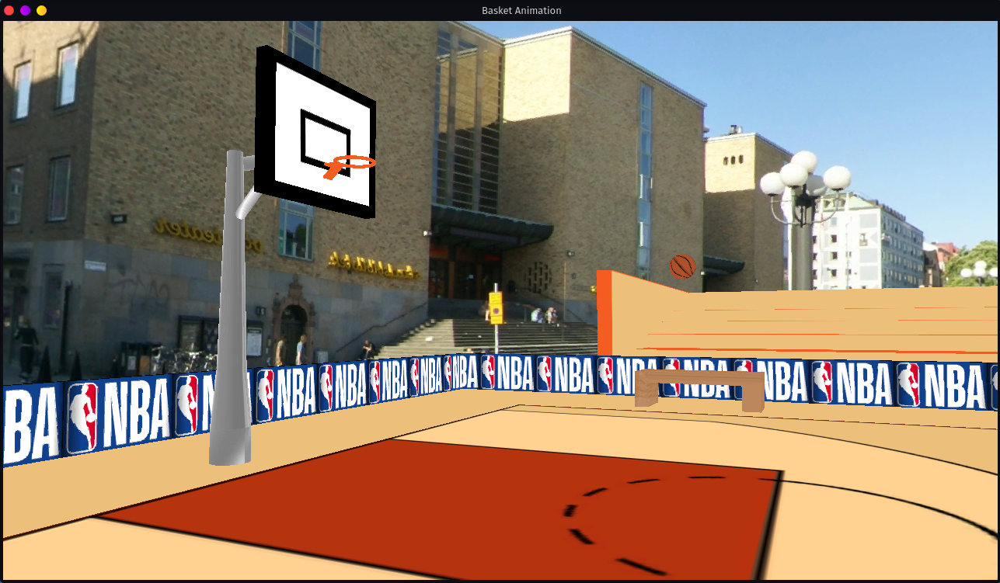

# P5 - Animação Basket

This project is part of the course CG (computer graphics) in UAlg\
As a group we were tasked to make either a game or an animation, using OpenGL. This means we had to make an engine that renders in real time a game or a animation.

Our group chose to make an Animation.

## Objective

An animation where a Basketball ball is jumps to the rim and scores and comes back to the beginning jumping a few times on the floor. This would be done in a loop until the program is closed.

To accomplish this there were a few key elements that needed to be done:

* An engine that can load objects with textures, and place them wherever we want.
* The objects to be rendered along with their textures.
* Some way of animating the objects within the engine.

To achieve this main objective we:

* Created a simple engine that can render many individual objects as needed;
* Created the scene using [Blender](https://www.blender.org);
* In every object of the scene we adjusted the UVs and textures;
* Added a way to import objects from .obj object files;
* Imported and placed all objects in our scene;
* Added a way to import textures from .dds image files;
* Converted all images from .png to .dds using [compressonatorcli](https://github.com/GPUOpen-Tools/Compressonator/releases) from AMD;
* Imported all the textures;
* Applied the textures to the objects;
* Added a way to animate any object;
* Added a way to import animations using custom .amn files;
* Created and applied the animation on the ball.

Things we set out to do that were not done:

* Apply lights and shadows to the objects on our scene;
* Create a scoreboard that displays the current score and increases every time the ball enters the rim.

## Development Platform

To develop this project, we used [Visual Studio Code](https://code.visualstudio.com/ (VSCode Website)) with the [C/C++ extension pack](https://marketplace.visualstudio.com/items?itemName=ms-vscode.cpptools-extension-pack (VSCode Marketplace)).

To build the project I used [CMake](https://cmake.org/ (CMake website)), and Make to compile it.\
Since it's a C++ based project, GCC was used to compile the program.

Required libraries:

* [OpenGL](https://www.opengl.org/ (OpenGL Website)) - v4.6
* [GLFW](https://www.glfw.org/ (GLFW website)) - v3.3.3
* [GLAD](https://glad.dav1d.de/ (Multi-Language GL/GLES/EGL/GLX/WGL Loader-Generator)) - v0.1.34

Both GLAD and GLFW are libraries downloaded for this project and were placed in the ./p/external directory.
The OpenGL library is located outside of the project directory.

## References

As a reference we used and learnt a ton from [opengl-tutorial.org](http://www.opengl-tutorial.org/ (opengl-tutoria website)).\
Some of functions used in this project came from the opengl-tutorial.org guides and git repository. More specifically:

* loadShaders(), to load all shader files;
* loadDDS(), to load a image file with the .dds format to be used as a texture.
This one was modified to use Anisotropic filtering instead of trilinear filtering with mipmaping
* loadOBJ(), to load all objects with the .obj format

## Results

### build and run

To compile and run the project in a simple way a simple script was created. This script was very useful during the development of the project.

To run this script open a terminal on the ```animation/build/``` directory and run the folowing command:

```bash
./run.sh
```

A window like [this](#the-window) should open with the ball bouncing around.

### build only

Make sure you have the terminal open on the ```animation/build/``` directory.\
To compile the project we need to run the following commands:

```bash
cmake .. && make
```

If for some reason it fails try:

```bash
cmake -S .. -B . && make
```

[cmake output](#cmake-output) & [make output](#make-output)\
The complied output will then be saved inside ./p/build/proj/basket.exe

### run only

Make sure you have the terminal open on the ```animation/build/``` directory.\
To run the program that opens the openGL program do:

```bash
./proj/basket.exe
```

A window like [this](#the-window) should open with the ball bouncing around.

### Screenshots

#### the window



#### cmake output

```bash
$ cmake ..
-- The C compiler identification is GNU 11.1.0
-- The CXX compiler identification is GNU 11.1.0
-- Detecting C compiler ABI info
-- Detecting C compiler ABI info - done
-- Check for working C compiler: /usr/bin/cc - skipped
-- Detecting C compile features
-- Detecting C compile features - done
-- Detecting CXX compiler ABI info
-- Detecting CXX compiler ABI info - done
-- Check for working CXX compiler: /usr/bin/c++ - skipped
-- Detecting CXX compile features
-- Detecting CXX compile features - done
-- Found OpenGL: /usr/lib/libOpenGL.so   
-- Looking for pthread.h
-- Looking for pthread.h - found
-- Performing Test CMAKE_HAVE_LIBC_PTHREAD
-- Performing Test CMAKE_HAVE_LIBC_PTHREAD - Failed
-- Looking for pthread_create in pthreads
-- Looking for pthread_create in pthreads - not found
-- Looking for pthread_create in pthread
-- Looking for pthread_create in pthread - found
-- Found Threads: TRUE  
-- Could NOT find Doxygen (missing: DOXYGEN_EXECUTABLE) 
-- Using X11 for window creation
-- Found X11: /usr/include   
-- Looking for XOpenDisplay in /usr/lib/libX11.so;/usr/lib/libXext.so
-- Looking for XOpenDisplay in /usr/lib/libX11.so;/usr/lib/libXext.so - found
-- Looking for gethostbyname
-- Looking for gethostbyname - found
-- Looking for connect
-- Looking for connect - found
-- Looking for remove
-- Looking for remove - found
-- Looking for shmat
-- Looking for shmat - found
-- Looking for IceConnectionNumber in ICE
-- Looking for IceConnectionNumber in ICE - found
-- Configuring done
-- Generating done
-- Build files have been written to: /mnt/disk-2/files/Uni/CG/Animation/build
```

#### make output

```bash
$ make
[  0%] Building C object external/glfw-3.3.3/src/CMakeFiles/glfw.dir/context.c.o
[  1%] Building C object external/glfw-3.3.3/src/CMakeFiles/glfw.dir/init.c.o
[  2%] Building C object external/glfw-3.3.3/src/CMakeFiles/glfw.dir/input.c.o
[  3%] Building C object external/glfw-3.3.3/src/CMakeFiles/glfw.dir/monitor.c.o
[  4%] Building C object external/glfw-3.3.3/src/CMakeFiles/glfw.dir/vulkan.c.o
[  5%] Building C object external/glfw-3.3.3/src/CMakeFiles/glfw.dir/window.c.o
[  5%] Building C object external/glfw-3.3.3/src/CMakeFiles/glfw.dir/x11_init.c.o
[  6%] Building C object external/glfw-3.3.3/src/CMakeFiles/glfw.dir/x11_monitor.c.o
[  7%] Building C object external/glfw-3.3.3/src/CMakeFiles/glfw.dir/x11_window.c.o
[  8%] Building C object external/glfw-3.3.3/src/CMakeFiles/glfw.dir/xkb_unicode.c.o
[  9%] Building C object external/glfw-3.3.3/src/CMakeFiles/glfw.dir/posix_time.c.o
[ 10%] Building C object external/glfw-3.3.3/src/CMakeFiles/glfw.dir/posix_thread.c.o
[ 10%] Building C object external/glfw-3.3.3/src/CMakeFiles/glfw.dir/glx_context.c.o
[ 11%] Building C object external/glfw-3.3.3/src/CMakeFiles/glfw.dir/egl_context.c.o
[ 12%] Building C object external/glfw-3.3.3/src/CMakeFiles/glfw.dir/osmesa_context.c.o
[ 13%] Building C object external/glfw-3.3.3/src/CMakeFiles/glfw.dir/linux_joystick.c.o
[ 14%] Linking C static library libglfw3.a
[ 14%] Built target glfw
[ 15%] Building C object external/glfw-3.3.3/examples/CMakeFiles/boing.dir/boing.c.o
[ 16%] Building C object external/glfw-3.3.3/examples/CMakeFiles/boing.dir/__/deps/glad_gl.c.o
[ 17%] Linking C executable boing
[ 17%] Built target boing
[ 17%] Building C object external/glfw-3.3.3/examples/CMakeFiles/gears.dir/gears.c.o
[ 18%] Building C object external/glfw-3.3.3/examples/CMakeFiles/gears.dir/__/deps/glad_gl.c.o
[ 19%] Linking C executable gears
[ 19%] Built target gears
[ 20%] Building C object external/glfw-3.3.3/examples/CMakeFiles/heightmap.dir/heightmap.c.o
[ 20%] Building C object external/glfw-3.3.3/examples/CMakeFiles/heightmap.dir/__/deps/glad_gl.c.o
[ 21%] Linking C executable heightmap
[ 21%] Built target heightmap
[ 22%] Building C object external/glfw-3.3.3/examples/CMakeFiles/sharing.dir/sharing.c.o
[ 23%] Building C object external/glfw-3.3.3/examples/CMakeFiles/sharing.dir/__/deps/glad_gl.c.o
[ 24%] Linking C executable sharing
[ 24%] Built target sharing
[ 25%] Building C object external/glfw-3.3.3/examples/CMakeFiles/particles.dir/particles.c.o
[ 26%] Building C object external/glfw-3.3.3/examples/CMakeFiles/particles.dir/__/deps/tinycthread.c.o
[ 27%] Building C object external/glfw-3.3.3/examples/CMakeFiles/particles.dir/__/deps/getopt.c.o
[ 28%] Building C object external/glfw-3.3.3/examples/CMakeFiles/particles.dir/__/deps/glad_gl.c.o
[ 29%] Linking C executable particles
[ 29%] Built target particles
[ 29%] Building C object external/glfw-3.3.3/examples/CMakeFiles/simple.dir/simple.c.o
[ 30%] Building C object external/glfw-3.3.3/examples/CMakeFiles/simple.dir/__/deps/glad_gl.c.o
[ 31%] Linking C executable simple
[ 31%] Built target simple
[ 32%] Building C object external/glfw-3.3.3/examples/CMakeFiles/splitview.dir/splitview.c.o
[ 33%] Building C object external/glfw-3.3.3/examples/CMakeFiles/splitview.dir/__/deps/glad_gl.c.o
[ 33%] Linking C executable splitview
[ 33%] Built target splitview
[ 34%] Building C object external/glfw-3.3.3/examples/CMakeFiles/offscreen.dir/offscreen.c.o
[ 35%] Building C object external/glfw-3.3.3/examples/CMakeFiles/offscreen.dir/__/deps/glad_gl.c.o
[ 36%] Linking C executable offscreen
[ 36%] Built target offscreen
[ 37%] Building C object external/glfw-3.3.3/examples/CMakeFiles/wave.dir/wave.c.o
[ 37%] Building C object external/glfw-3.3.3/examples/CMakeFiles/wave.dir/__/deps/glad_gl.c.o
[ 38%] Linking C executable wave
[ 38%] Built target wave
[ 39%] Building C object external/glfw-3.3.3/tests/CMakeFiles/triangle-vulkan.dir/triangle-vulkan.c.o
[ 40%] Building C object external/glfw-3.3.3/tests/CMakeFiles/triangle-vulkan.dir/__/deps/glad_vulkan.c.o
[ 41%] Linking C executable triangle-vulkan
[ 41%] Built target triangle-vulkan
[ 42%] Building C object external/glfw-3.3.3/tests/CMakeFiles/tearing.dir/tearing.c.o
[ 43%] Building C object external/glfw-3.3.3/tests/CMakeFiles/tearing.dir/__/deps/glad_gl.c.o
[ 44%] Linking C executable tearing
[ 44%] Built target tearing
[ 45%] Building C object external/glfw-3.3.3/tests/CMakeFiles/title.dir/title.c.o
[ 45%] Building C object external/glfw-3.3.3/tests/CMakeFiles/title.dir/__/deps/glad_gl.c.o
[ 46%] Linking C executable title
[ 46%] Built target title
[ 47%] Building C object external/glfw-3.3.3/tests/CMakeFiles/opacity.dir/opacity.c.o
[ 48%] Building C object external/glfw-3.3.3/tests/CMakeFiles/opacity.dir/__/deps/glad_gl.c.o
[ 48%] Linking C executable opacity
[ 48%] Built target opacity
[ 48%] Building C object external/glfw-3.3.3/tests/CMakeFiles/clipboard.dir/clipboard.c.o
[ 49%] Building C object external/glfw-3.3.3/tests/CMakeFiles/clipboard.dir/__/deps/getopt.c.o
[ 50%] Building C object external/glfw-3.3.3/tests/CMakeFiles/clipboard.dir/__/deps/glad_gl.c.o
[ 51%] Linking C executable clipboard
[ 51%] Built target clipboard
[ 52%] Building C object external/glfw-3.3.3/tests/CMakeFiles/msaa.dir/msaa.c.o
[ 53%] Building C object external/glfw-3.3.3/tests/CMakeFiles/msaa.dir/__/deps/getopt.c.o
[ 54%] Building C object external/glfw-3.3.3/tests/CMakeFiles/msaa.dir/__/deps/glad_gl.c.o
[ 54%] Linking C executable msaa
[ 54%] Built target msaa
[ 55%] Building C object external/glfw-3.3.3/tests/CMakeFiles/glfwinfo.dir/glfwinfo.c.o
[ 55%] Building C object external/glfw-3.3.3/tests/CMakeFiles/glfwinfo.dir/__/deps/getopt.c.o
[ 56%] Building C object external/glfw-3.3.3/tests/CMakeFiles/glfwinfo.dir/__/deps/glad_gl.c.o
[ 57%] Building C object external/glfw-3.3.3/tests/CMakeFiles/glfwinfo.dir/__/deps/glad_vulkan.c.o
[ 58%] Linking C executable glfwinfo
[ 58%] Built target glfwinfo
[ 59%] Building C object external/glfw-3.3.3/tests/CMakeFiles/iconify.dir/iconify.c.o
[ 59%] Building C object external/glfw-3.3.3/tests/CMakeFiles/iconify.dir/__/deps/getopt.c.o
[ 60%] Building C object external/glfw-3.3.3/tests/CMakeFiles/iconify.dir/__/deps/glad_gl.c.o
[ 61%] Linking C executable iconify
[ 61%] Built target iconify
[ 61%] Building C object external/glfw-3.3.3/tests/CMakeFiles/reopen.dir/reopen.c.o
[ 62%] Building C object external/glfw-3.3.3/tests/CMakeFiles/reopen.dir/__/deps/glad_gl.c.o
[ 63%] Linking C executable reopen
[ 63%] Built target reopen
[ 64%] Building C object external/glfw-3.3.3/tests/CMakeFiles/gamma.dir/gamma.c.o
[ 65%] Building C object external/glfw-3.3.3/tests/CMakeFiles/gamma.dir/__/deps/glad_gl.c.o
[ 66%] Linking C executable gamma
[ 66%] Built target gamma
[ 67%] Building C object external/glfw-3.3.3/tests/CMakeFiles/monitors.dir/monitors.c.o
[ 68%] Building C object external/glfw-3.3.3/tests/CMakeFiles/monitors.dir/__/deps/getopt.c.o
[ 68%] Building C object external/glfw-3.3.3/tests/CMakeFiles/monitors.dir/__/deps/glad_gl.c.o
[ 69%] Linking C executable monitors
[ 69%] Built target monitors
[ 70%] Building C object external/glfw-3.3.3/tests/CMakeFiles/windows.dir/windows.c.o
[ 71%] Building C object external/glfw-3.3.3/tests/CMakeFiles/windows.dir/__/deps/getopt.c.o
[ 72%] Building C object external/glfw-3.3.3/tests/CMakeFiles/windows.dir/__/deps/glad_gl.c.o
[ 73%] Linking C executable windows
[ 73%] Built target windows
[ 74%] Building C object external/glfw-3.3.3/tests/CMakeFiles/timeout.dir/timeout.c.o
[ 75%] Building C object external/glfw-3.3.3/tests/CMakeFiles/timeout.dir/__/deps/glad_gl.c.o
[ 76%] Linking C executable timeout
[ 76%] Built target timeout
[ 77%] Building C object external/glfw-3.3.3/tests/CMakeFiles/inputlag.dir/inputlag.c.o
[ 78%] Building C object external/glfw-3.3.3/tests/CMakeFiles/inputlag.dir/__/deps/getopt.c.o
[ 79%] Building C object external/glfw-3.3.3/tests/CMakeFiles/inputlag.dir/__/deps/glad_gl.c.o
[ 79%] Linking C executable inputlag
[ 79%] Built target inputlag
[ 80%] Building C object external/glfw-3.3.3/tests/CMakeFiles/threads.dir/threads.c.o
[ 81%] Building C object external/glfw-3.3.3/tests/CMakeFiles/threads.dir/__/deps/tinycthread.c.o
[ 81%] Building C object external/glfw-3.3.3/tests/CMakeFiles/threads.dir/__/deps/glad_gl.c.o
[ 82%] Linking C executable threads
[ 82%] Built target threads
[ 83%] Building C object external/glfw-3.3.3/tests/CMakeFiles/cursor.dir/cursor.c.o
[ 84%] Building C object external/glfw-3.3.3/tests/CMakeFiles/cursor.dir/__/deps/glad_gl.c.o
[ 84%] Linking C executable cursor
[ 84%] Built target cursor
[ 85%] Building C object external/glfw-3.3.3/tests/CMakeFiles/empty.dir/empty.c.o
[ 86%] Building C object external/glfw-3.3.3/tests/CMakeFiles/empty.dir/__/deps/tinycthread.c.o
[ 87%] Building C object external/glfw-3.3.3/tests/CMakeFiles/empty.dir/__/deps/glad_gl.c.o
[ 88%] Linking C executable empty
[ 88%] Built target empty
[ 89%] Building C object external/glfw-3.3.3/tests/CMakeFiles/icon.dir/icon.c.o
[ 90%] Building C object external/glfw-3.3.3/tests/CMakeFiles/icon.dir/__/deps/glad_gl.c.o
[ 91%] Linking C executable icon
[ 91%] Built target icon
[ 92%] Building C object external/glfw-3.3.3/tests/CMakeFiles/events.dir/events.c.o
[ 92%] Building C object external/glfw-3.3.3/tests/CMakeFiles/events.dir/__/deps/getopt.c.o
[ 93%] Building C object external/glfw-3.3.3/tests/CMakeFiles/events.dir/__/deps/glad_gl.c.o
[ 94%] Linking C executable events
[ 94%] Built target events
[ 95%] Building C object external/glfw-3.3.3/tests/CMakeFiles/joysticks.dir/joysticks.c.o
[ 96%] Building C object external/glfw-3.3.3/tests/CMakeFiles/joysticks.dir/__/deps/glad_gl.c.o
[ 97%] Linking C executable joysticks
[ 97%] Built target joysticks
[ 98%] Building C object external/glad/CMakeFiles/glad.dir/src/glad.c.o
[ 99%] Linking C static library libglad.a
[ 99%] Built target glad
[ 99%] Building CXX object proj/CMakeFiles/basket.exe.dir/main.cpp.o
[100%] Linking CXX executable basket.exe
[100%] Built target basket.exe
```
